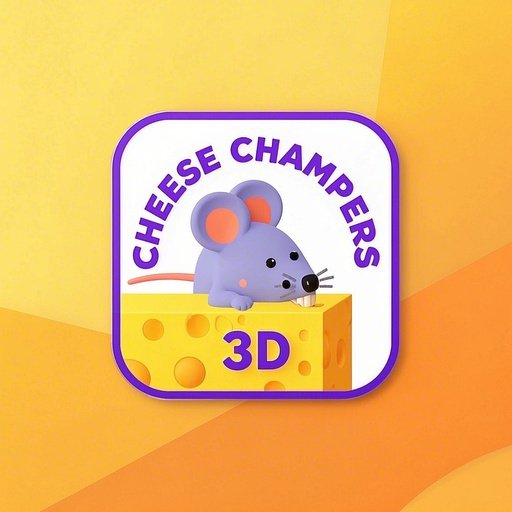

# Cheese Chompers 3D

A hilarious physics-based game where wobbly rats battle for cheese glory! This is the official website for Cheese Chompers 3D, built with Astro and deployed on Cloudflare Pages.

## 🎮 Game Features

- **Physics-Based Gameplay**: Control wobbly rats in chaotic battles
- **Multiplayer Fun**: Push rivals off the arena and be the last rat standing
- **No Download Required**: Play directly in your browser
- **Mobile Friendly**: Enjoy the game on any device

## 🚀 Website Features

- Responsive design for all devices
- Fast loading with optimized assets
- SEO optimized for better discoverability
- Embedded gameplay videos and tutorials
- Comprehensive game tips and strategies

## 🧞 Development Commands

All commands are run from the root of the project, from a terminal:

| Command                   | Action                                           |
| :------------------------ | :----------------------------------------------- |
| `npm install`             | Installs dependencies                            |
| `npm run dev`             | Starts local dev server at `localhost:4321`      |
| `npm run build`           | Build your production site to `./dist/`          |
| `npm run preview`         | Preview your build locally, before deploying     |

## 🌐 Deployment

This website is deployed on Cloudflare Pages with continuous deployment from GitHub. Any push to the main branch will trigger a new build and deployment.

## 🔧 Technologies Used

- [Astro](https://astro.build) - The web framework for content-driven websites
- [Cloudflare Pages](https://pages.cloudflare.com) - For hosting and deployment
- [Cloudflare Workers](https://workers.cloudflare.com) - For serverless functions

## 📝 License

© 2025 Cheese Chompers 3D. All rights reserved.
